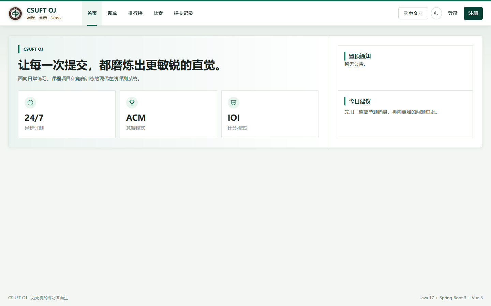

# CSUFT Online Judge

一个面向课程设计与程序设计练习的在线判题系统，提供题目练习、代码提交、自动评测、竞赛、排行榜、用户管理和运行监控等功能。

> 在线访问：[https://wangteng.site](https://wangteng.site)



## 主要功能

- 用户注册、登录、个人资料与密码管理
- 题目浏览、标签筛选、样例展示与在线代码编辑
- 支持 C++17、Java 17、Python 3 和 Go
- 自动编译、运行及测试点判题
- 提交记录、通过统计与用户排行榜
- 竞赛创建、报名、答题和实时排名
- 教师/管理员题目与竞赛管理
- 管理员用户管理、审计日志及系统监控
- 中英文界面切换

## 技术栈

| 模块 | 技术 |
| --- | --- |
| 前端 | Vue 3、Vite、Element Plus、Pinia、Vue Router、ECharts、Monaco Editor |
| 后端 | Java 17、Spring Boot 3、Spring Security、MyBatis-Plus、Flyway |
| 数据库 | MySQL 8.4 |
| 部署 | Docker、Docker Compose、Nginx |
| 监控 | Spring Boot Actuator、Prometheus Metrics |

## 本地一键部署

推荐使用 Docker Compose，它会同时启动 MySQL、后端、前端和判题环境。

### 1. 准备环境

- Git
- Docker Desktop（Windows/macOS）或 Docker Engine + Compose Plugin（Linux）
- 建议至少 4 GB 可用内存

克隆项目：

```bash
git clone https://github.com/printf-wt/Software-Engineering-Course-Design.git
cd Software-Engineering-Course-Design
```

### 2. Windows Docker Desktop

在 PowerShell 中执行：

```powershell
Copy-Item .env.local.example .env.local
New-Item -ItemType Directory -Force `
  C:\csuft-oj-data\testcases, `
  C:\csuft-oj-data\judge-temp, `
  C:\csuft-oj-data\logs | Out-Null

docker compose --env-file .env.local `
  -f docker-compose.yml `
  -f docker-compose.local.yml `
  up -d --build
```

查看容器状态：

```powershell
docker compose --env-file .env.local `
  -f docker-compose.yml `
  -f docker-compose.local.yml `
  ps
```

服务显示为 `healthy` 后，访问：

```text
http://127.0.0.1:8080
```

### 3. Linux

复制生产环境配置并修改其中的密码、JWT 密钥、数据目录和 Docker 组 ID：

```bash
cp .env.example .env
mkdir -p /srv/csuft-oj/{testcases,judge-temp,logs}
stat -c '%g' /var/run/docker.sock
```

将最后一条命令输出的数字填写到 `.env` 的 `DOCKER_GID`，然后启动：

```bash
docker compose up -d --build
docker compose ps
```

默认仅监听 `127.0.0.1:8080`。公网部署时应使用 Nginx、Caddy 或云负载均衡器提供 HTTPS 反向代理。

## 常用命令

以下 Windows 示例中的 `COMPOSE` 表示：

```powershell
docker compose --env-file .env.local -f docker-compose.yml -f docker-compose.local.yml
```

实际使用时请写出完整命令。例如：

```powershell
# 查看日志
docker compose --env-file .env.local -f docker-compose.yml -f docker-compose.local.yml logs -f backend

# 停止服务并保留数据库
docker compose --env-file .env.local -f docker-compose.yml -f docker-compose.local.yml down

# 停止服务并删除数据库卷（数据不可恢复）
docker compose --env-file .env.local -f docker-compose.yml -f docker-compose.local.yml down -v
```

后端健康检查：

```powershell
docker compose --env-file .env.local -f docker-compose.yml -f docker-compose.local.yml `
  exec backend curl -fsS http://127.0.0.1:8081/actuator/health/readiness
```

## 创建管理员

项目不提供默认管理员账号。先在网页注册普通用户，再执行下面的命令提升权限。

Windows 本地部署示例：

```powershell
docker compose --env-file .env.local -f docker-compose.yml -f docker-compose.local.yml `
  exec mysql mysql -ucsuft_oj -plocal-csuft-oj-db-password csuft_oj `
  -e "UPDATE tb_user SET role='ADMIN', token_version=token_version+1 WHERE username='你的用户名';"
```

执行后退出账号并重新登录。

> 如果修改过 `.env.local` 中的数据库用户名或密码，请同步修改命令中的参数。生产环境请勿在命令历史中直接暴露密码。

## 源码开发

Docker Compose 是最完整的运行方式；如需分别开发前后端，可按下面的方式启动。

### 后端

要求 Java 17、Maven 3.9 和可用的 MySQL 8 数据库。

```bash
cd csuft-oj-backend
mvn spring-boot:run
```

运行测试：

```bash
mvn test
```

### 前端

要求 Node.js 18 或更高版本。

```bash
cd csuft-oj-frontend
npm install
npm run dev
```

开发服务器地址为 `http://localhost:5173`。`/api` 请求默认代理到 `http://localhost:8080`。

构建生产版本：

```bash
npm run build
```

## 项目结构

```text
.
├── csuft-oj-backend/       Spring Boot 后端与判题服务
├── csuft-oj-frontend/      Vue 前端与 Nginx 配置
├── docs/                   系统架构图及设计文档
├── scripts/                部署和题目初始化脚本
├── docker-compose.yml      通用/生产部署编排
├── docker-compose.local.yml
├── .env.example            Linux/生产配置模板
└── .env.local.example      Windows 本地配置模板
```

## 部署与安全提示

- 不要提交 `.env` 或 `.env.local`，其中包含数据库密码和 JWT 密钥。
- 生产环境必须替换示例密码，并为 `JWT_SECRET` 使用足够长的随机值。
- 判题服务通过 Docker Socket 创建隔离运行容器。Docker Socket 具有较高主机权限，请只在可信、专用的服务器上部署。
- 生产环境应启用 HTTPS；项目的生产刷新 Cookie 默认启用 `Secure`。
- 发布包含 Flyway 数据库迁移的版本前，请先备份数据库。
- 当前判题队列和限流状态保存在单个后端进程中，不建议直接横向扩容后端实例。

更完整的说明：

- [本地部署文档](LOCAL_DEPLOYMENT.md)
- [生产运维文档](OPERATIONS.md)
- [系统架构图](docs/system-diagrams.md)

## 许可证与用途

本项目主要用于软件工程课程设计、学习和交流。若需要公开部署、二次分发或用于其他场景，请先确认项目所使用依赖及素材的许可要求。
