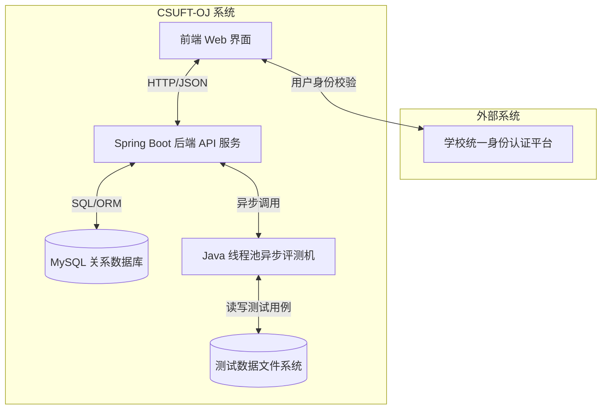
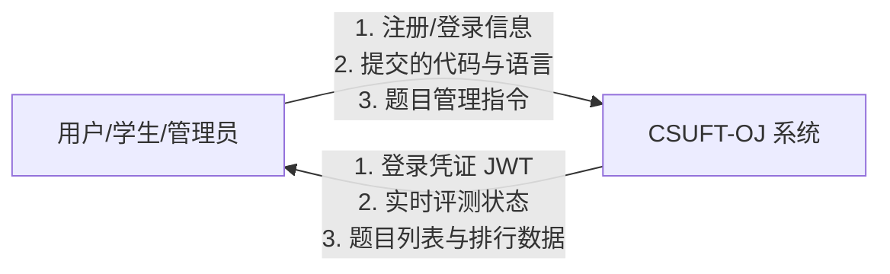
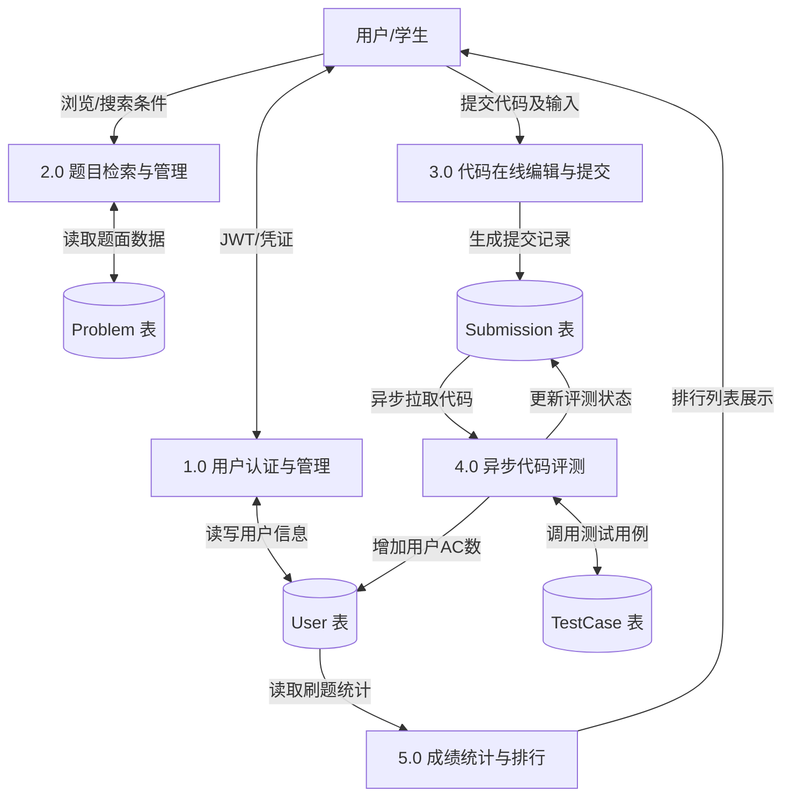
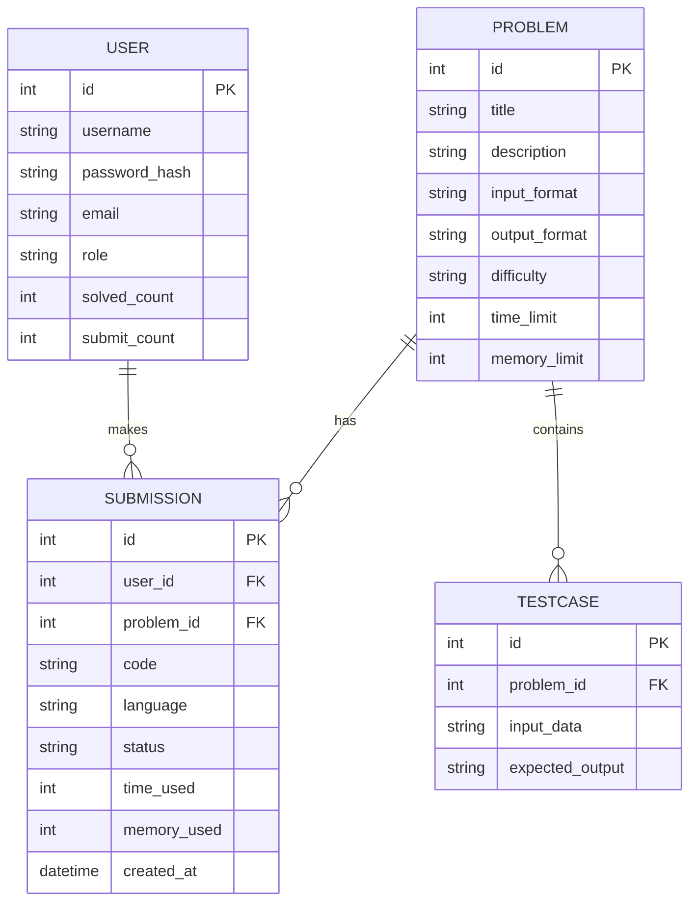

# 中南林业科技大学 Online Judge (CSUFT OJ) 系统——软件需求规格说明书

## 3 软件需求分析要求

### 3.1 任务概述

#### 3.1.1 目标
中南林业科技大学 Online Judge (CSUFT OJ) 系统是为了解决计算机与数学学院计算机科学与技术系师生在《程序设计基础》、《数据结构与算法》、《软件工程》等课程教学实践中，缺乏统一、高效、自动化的编程作业评测与反馈平台这一主要问题而开发的。

*   **开发意图**：提供一个现代化的、具备高并发异步评测能力的在线评测系统，帮助学生提升编程实践与算法分析能力，同时降低教师人工批改代码的工作量。
*   **应用目标**：面向中南林业科技大学全体师生，提供日常刷题、作业提交、在线考试、自动评测和排行榜等功能。
*   **作用范围**：中南林业科技大学校内局域网及校园网环境，涵盖计算机及相关专业的所有程序设计类课程。
*   **本软件同其他系统的联系与接口**：本系统作为独立的 Web 应用运行，但在架构上预留了与学校统一身份认证系统（LDAP/OAuth2）的对接接口。系统组成框图如下：

#### 3.1.2 运行环境
*   **硬件环境**：
    *   **开发与评测服务器**：Intel Core i7 或 Xeon 4核以上处理器，16GB RAM，100GB SSD 存储。
    *   **客户端设备**：能够运行主流 Web 浏览器的个人电脑（PC、笔记本）。
*   **软件环境**：
    *   **服务器端**：Windows 10/11 或 Linux (CentOS/Ubuntu)，JDK 17，MySQL 8.0，G++ 编译器，Python 3.10 环境。
    *   **客户端**：主流现代浏览器（Chrome、Edge、Firefox、Safari等）。

#### 3.1.3 假定和约束
*   **开发期限**：根据实训安排，开发与联调期限为 3 周，上机课时共计 20 学时。
*   **安全性约束**：评测引擎执行用户提交的代码时，必须实施时间、内存空间限制，且防范恶意系统调用（如格式化磁盘、网络攻击等）。
*   **技术栈约束**：前端采用 Vue 3 + Element Plus，后端采用 Java Spring Boot + MyBatis-Plus，保证高性能前后端分离。

---

### 3.2 需求规定

#### 3.2.1 对功能的规定

本系统支持的终端用户数设计为不限制（基于 Web），系统可支持的并发在线人数不少于 **200人**，并发评测吞吐量不少于 **20次/秒**。

##### 1. 功能模块划分（逻辑模块）与描述

系统逻辑上分为以下五个核心功能模块：
1.  **用户管理模块**：处理用户注册、登录（JWT 认证）、个人资料修改、刷题热力图及统计图表渲染。
2.  **题库管理模块**：管理题目列表，提供按难度（Easy/Medium/Hard）、标签（动态规划、贪心、图论等）的分类检索与极速搜索。
3.  **在线做题模块（Playground）**：提供 Monaco Editor 在线代码编辑器，支持多语言切换，支持样例输入一键复制、自测运行与一键提交。
4.  **评测引擎模块（Judge）**：基于 Java 线程池与阻塞队列实现，异步编译运行代码，执行测试用例比对，支持超时拦截。
5.  **排行榜模块（Ranklist）**：统计全校学生的 AC（通过）题数及提交通过率，提供动态排序与分页展示。

##### 2. 功能模型：数据流图（DFD）

根据指导书要求，本系统的数据流图分为顶层和一层。

###### 【顶层数据流图】

###### 【一层数据流图】

##### 3. 输入-处理-输出（IPO）表设计

系统核心业务流程 of IPO表设计如下：

| 功能模块 | 输入项 (Input) | 处理逻辑 (Process) | 输出项 (Output) |
| :--- | :--- | :--- | :--- |
| **1. 用户注册** | 用户名、密码、邮箱、头像选择。 | 1. 校验用户名是否唯一。 2. 对密码进行 BCrypt 强哈希加密。 3. 存入数据库 User 表。 | 注册成功提示，跳转至登录页。 |
| **2. 提交代码评测** | 用户ID、题目ID、源代码、所选语言。 | 1. 将提交信息写入 Submission 表，状态设为 `PENDING`。 2. 任务推入评测线程池。 3. 评测线程在安全目录下编译/运行代码。 4. 使用自测点输入比对预期输出。 5. 判定结果（AC/WA/TLE/RE/CE）。 | 返回评测状态，更新个人及题目的统计数据。 |
| **3. 管理员添加题目** | 标题、描述、输入输出格式、时空限制、测试用例。 | 1. 格式化题面 Markdown 数据。 2. 将测试点输入输出存入测试数据库/文件系统。 3. 题目信息保存至 Problem 表。 | 提示题目创建成功，题库列表实时更新。 |

##### 4. 数据模型：概念模型（E-R 图）

本系统的 E-R 图如下：

---

### 3.2.2 对性能的规定

#### 3.2.2.1 精度
*   **评测结果判定精度**：输出文本比对默认忽略行末空格与文末换行符（PE 兼容模式），但内容比对精确到每一个字节。
*   **数值统计精度**：用户通过率、题目通过率等统计保留至小数点后 **2 位**。
*   **计时精度**：程序运行时间限制计时精度为 **1毫秒 (ms)**。

#### 3.2.2.2 时间特性要求
*   **系统响应时间**：常规页面（题库、排行、主页）查询响应时间 $< 300\text{ms}$。
*   **代码提交响应时间**：提交操作瞬间返回（$< 100\text{ms}$），代码入队评测。
*   **单点评测时间**：评测引擎对单个测试用例的比对与判定时间 $< 50\text{ms}$（不含代码实际运行时间限制）。
*   **更新处理时间**：排行榜与热力图为实时计算更新，延迟 $< 1\text{秒}$。

#### 3.2.2.3 灵活性
*   **操作方式的灵活性**：前端界面全面支持响应式布局，完美适配 PC 端大屏做题与移动端查看排行/提交状态。
*   **评测机扩展性**：评测服务采用策略模式（Strategy Pattern）设计，能非常方便地通过增加具体策略类来扩展对新编程语言（如 Go, Rust）的支持。
*   **数据库兼容性**：后端配置支持 MySQL 8.0 生产库与 H2/SQLite 轻量化本地文件数据库的一键切换，便于跨操作系统运行及答辩演示。

---

### 3.3 输入输出要求

*   **输入要求**：
    *   **源代码**：通过在线编辑器输入，编码统一为 `UTF-8`，长度限制为 64KB 以内。
    *   **测试数据输入**：支持标准输入流（System.in/cin）。
*   **输出要求**：
    *   **正常输出（AC）**：页面显示醒目的绿色 `Accepted` 徽章，同时提供耗时 and 内存使用数据。
    *   **状态输出**：评测中实时推送状态，如 `Compiling`（编译中）、`Running Case 1/10` 等。
    *   **异常输出**：对于 `Wrong Answer`，显示首次出错的测试用例样例比对；对于 `Compile Error`，输出详细的编译器报错日志（以红色高亮代码块显示），便于定位语法错误。

---

### 3.4 数据管理能力要求

*   **存储规模预估**：
    *   **用户量**：预计初始注册学生 2000 人，年增长 500 人。
    *   **题库规模**：初始内置题目 100 道，预留支持 1000 道以上。
    *   **提交记录**：预计每学期每人平均提交 200 次，一学期产生约 40 万条记录。
    *   **存储大小估算**：单条提交记录平均 2KB，40万条约 800MB，加上题目数据与日志，MySQL 数据库占用空间约为 **1.5GB/学期**，系统设计吞吐量完全在轻量级 MySQL 的承载范围内。

---

### 3.5 故障处理要求

1.  **用户提交死循环或恶意代码**：
    *   **后果**：可能占用服务器 CPU/内存导致系统崩溃。
    *   **处理机制**：评测服务启动独立的线程监控运行时间，一旦子进程执行时间超过题目限制的 `time_limit`（例如 1000ms），立即调用 `process.destroyForcibly()` 强制终止子进程，并标记该提交状态为 `TIME_LIMIT_EXCEEDED`，释放系统资源。
2.  **网络波动/连接中断**：
    *   **后果**：代码编辑提交失败或状态无法实时渲染。
    *   **处理机制**：前端做题状态支持自动缓存至浏览器 `localStorage`，断网重连后可一键恢复未保存的草稿；API 请求提供友好的超时断网友好提示。

---

### 3.6 其他专门要求

1.  **安全保密**：密码采用 BCrypt 强哈希算法进行非对称加密存储，登录会话使用包含时效限制的 JWT (JSON Web Token) 进行校验，防止重放攻击和 SQL 注入。
2.  **易读性与可维护性**：后端代码严格遵循阿里巴巴 Java 开发手册规范，利用 MyBatis-Plus 减少冗余的 SQL 书写；前端采用 Vue 3 组合式 API (Composition API) 编写，代码高内聚低耦合。
3.  **可靠性**：支持多线程评测队列，当并发量极大时，评测机只按队列顺序并发评测，绝对不会因为提交过多而导致 Spring Boot 进程 OOM（内存溢出）。
