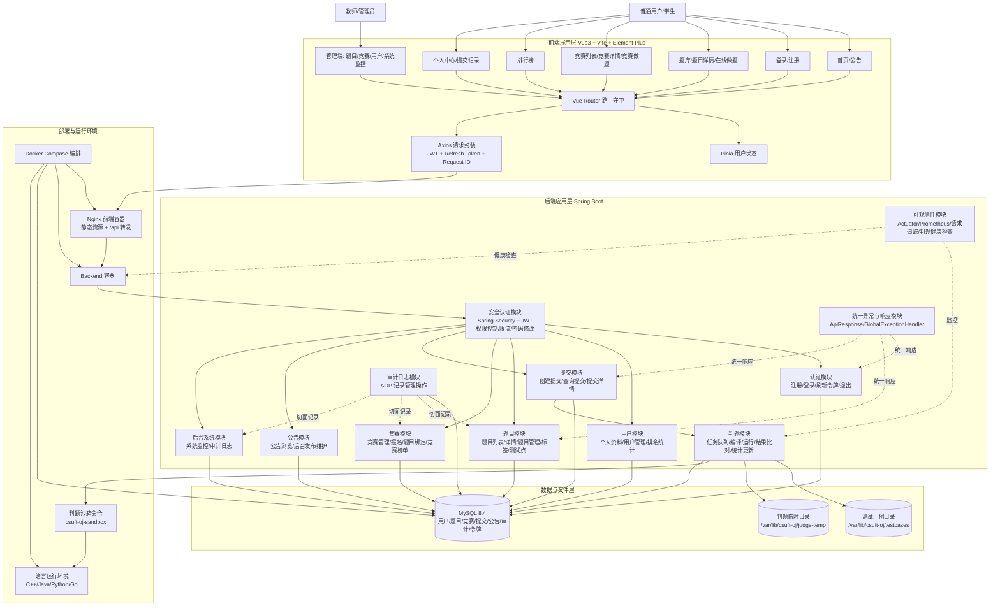

# CSUFT OJ 系统模块图与系统流程图

## 一、系统模块图

## 二、系统流程图

```mermaid
flowchart TD
    start([开始])
    open["用户打开 CSUFT OJ 前端"]
    route["Vue Router 判断访问页面"]
    needLogin{"页面是否需要登录?"}
    hasToken{"本地是否已有 Access Token?"}
    refresh["调用 /api/auth/refresh\n尝试用 Refresh Token 恢复会话"]
    refreshOk{"恢复成功?"}
    loginPage["跳转登录页"]
    login["用户登录/注册"]
    issueToken["后端校验账号\n签发 JWT 与 Refresh Token"]
    browse["进入系统功能页\n题库/竞赛/榜单/个人中心"]

    chooseProblem["选择题目或竞赛题目"]
    checkContest{"是否为竞赛提交?"}
    validateContest["校验竞赛状态、时间、题目绑定、报名状态"]
    editCode["在线编辑代码\n选择语言 C++/Java/Python/Go"]
    submit["提交代码到 /api/submissions"]

    authCheck["后端 JWT 鉴权与权限检查"]
    validateSubmit["校验题目、语言、代码长度、可见性"]
    savePending["写入 tb_submission\n状态 PENDING\n更新提交次数"]
    enqueue["事务提交后加入判题队列"]

    worker["JudgeDispatcher 工作线程取任务"]
    markJudging["更新状态为 JUDGING"]
    loadData["读取提交、题目、测试用例"]
    prepare["创建临时目录并写入源代码"]
    compile{"是否需要编译且编译成功?"}
    compileError["记录 COMPILE_ERROR"]
    runCase["逐个运行测试用例"]
    timeout{"是否超时?"}
    runtimeError{"是否运行错误?"}
    compare{"输出是否匹配标准答案?"}
    failResult["记录 TLE/RE/WA 等结果"]
    accepted["记录 ACCEPTED\n分数 100"]
    updateStats["首次 AC 时更新用户解题数、题目通过数"]
    cleanup["清理判题临时目录"]

    queryResult["前端查询提交详情/提交列表"]
    showResult["展示判题状态、耗时、内存、错误信息"]
    finish([结束])

    start --> open --> route --> needLogin
    needLogin -- 否 --> browse
    needLogin -- 是 --> hasToken
    hasToken -- 是 --> browse
    hasToken -- 否 --> refresh --> refreshOk
    refreshOk -- 否 --> loginPage --> login --> issueToken --> browse
    refreshOk -- 是 --> browse

    browse --> chooseProblem --> checkContest
    checkContest -- 是 --> validateContest --> editCode
    checkContest -- 否 --> editCode
    editCode --> submit --> authCheck --> validateSubmit --> savePending --> enqueue

    enqueue --> worker --> markJudging --> loadData --> prepare --> compile
    compile -- 否 --> compileError --> cleanup
    compile -- 是 --> runCase --> timeout
    timeout -- 是 --> failResult --> cleanup
    timeout -- 否 --> runtimeError
    runtimeError -- 是 --> failResult --> cleanup
    runtimeError -- 否 --> compare
    compare -- 否 --> failResult --> cleanup
    compare -- 是 --> accepted --> updateStats --> cleanup

    cleanup --> queryResult --> showResult --> finish
```

## 三、主要模块说明

| 层次 | 模块 | 主要职责 |
| --- | --- | --- |
| 前端展示层 | 首页、题库、竞赛、榜单、个人中心、管理端 | 提供用户交互界面，调用后端 API 展示和提交数据 |
| 前端基础层 | Router、Pinia、Axios | 路由权限控制、登录状态维护、请求拦截和令牌刷新 |
| 后端安全层 | Security、JWT、限流、权限校验 | 保护需要登录、教师、管理员权限的接口 |
| 后端业务层 | 认证、用户、题目、竞赛、提交、公告、后台管理 | 实现 OJ 核心业务逻辑 |
| 判题层 | JudgeDispatcher、JudgeService、Sandbox | 异步处理提交，完成编译、运行、输出比对和结果归档 |
| 数据层 | MySQL、测试用例目录、判题临时目录 | 持久化业务数据，保存测试用例和判题运行文件 |
| 运维层 | Docker Compose、Nginx、Actuator、Prometheus | 容器编排、前端反向代理、健康检查与监控指标 |
